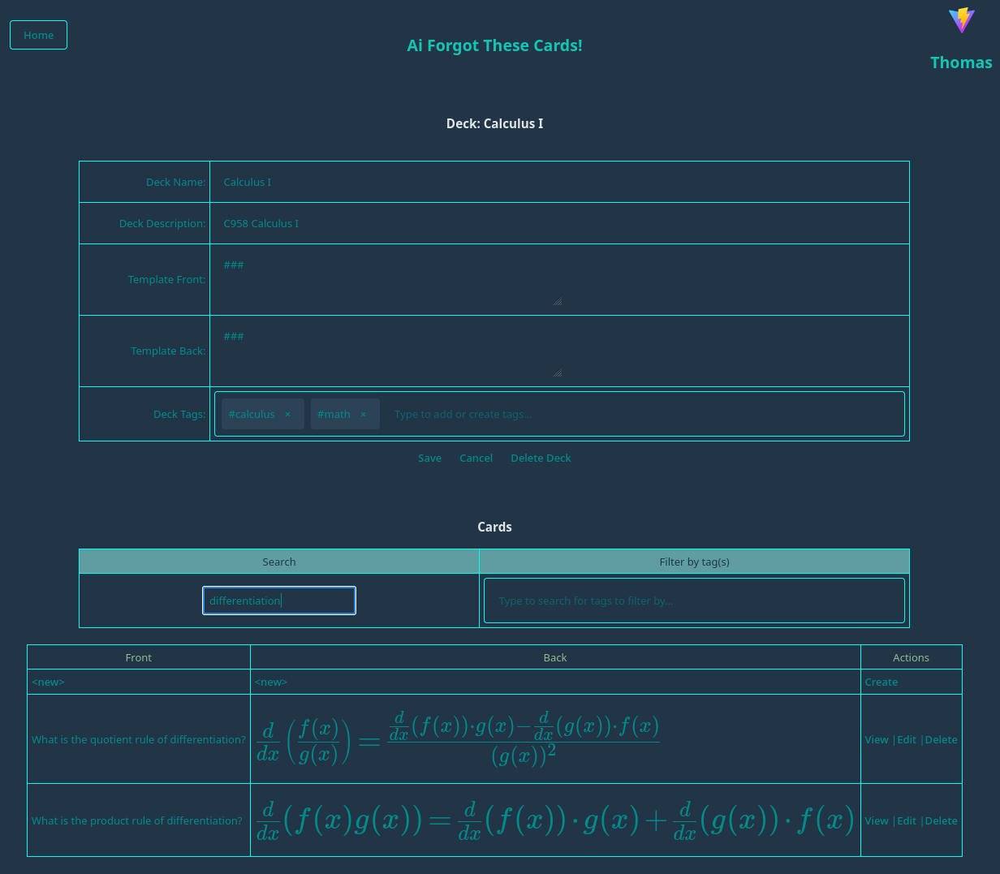

# Ai Forgot This Frontend

This is the frontend for [Ai Forgot These Cards](https://github.com/darkmusic/ai-forgot-these-cards), a web application that uses AI to enhance the flashcard creation process.



## Bulk entry AI tools

The AI tools frame generates additional cards, corrects facts, and enhances explanations.
Expand **More tools & options** for duplicate review and merging, additive tag suggestions,
topic gap generation, difficulty, and custom instructions. All actions use the current
draft, including unsaved cards and cards hidden by filters. Deleted and blank rows are excluded.

Changes remain in the editor until **Save All Changes**. **Compare Changes** shows the last
AI change; **Undo Last AI Change** preserves later manual edits and reports conflicts.
Duplicate merges are selected individually and retain the oldest saved card's review history.
Status and errors appear inside the frame. Closing the editor discards its draft and pending results.

## Tests

Run `npm run test:deck-assist` for draft changes, merge/undo, and SSE parsing tests.
Run `npm run test:browser` for the bulk entry workflow with mocked API responses.
Install a browser with `npx playwright install chromium`, or set
`PLAYWRIGHT_CHROMIUM_EXECUTABLE` to an existing Chromium executable. Browser tests start
their own Vite server and use synthetic cards; they do not call a model or database.

From the parent repository, run backend checks with:

```sh
./mvnw -Dskip.npm -Dskip.installnodenpm -Dtest=DeckAssistServiceTests,DeckAssistControllerTests,BulkAiSaveTests test
```

Opt-in model checks use `-Dtest=DeckAssistLiveTests -DdeckAssist.smoke=true` with optional
`-DdeckAssist.url=...`, `-DdeckAssist.model=...`, and `-DdeckAssist.operation=correct`.
For a hosted endpoint, supply `DECK_ASSIST_TEST_API_KEY` through the environment.
These checks send only synthetic cards and write responses under the parent's `target/` directory.
